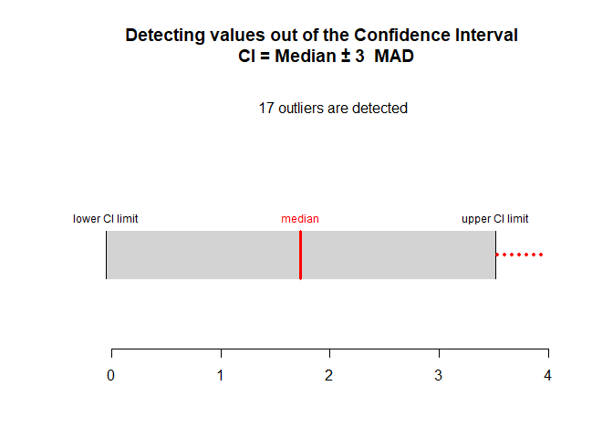

# Routliers

Routliers is designed to help researchers to detect univariate and
multivariate outliers, using robust methods: - The MAD method for
detecting univariate outliers (see Leys et al. 2013) - The MMCD method
for detecting multivariate outliers (see Leys et al. 2018) - The
Mahalanobis distance method for detecting multivariate outliers is also
available in order to facilite comparisons with the MMCD method.
However, this method is less robust than the MMCD method and should be
avoided.

Different functions are available in order to (a) detect univariate and
multivariate outliers (b) plot univariate and multivariate outliers.

## Installation

Currently, this package exists in a development version on GitHub. To
use the package, you need to install it directly from GitHub using the
`install_github` function from `devtools`.

You can use the following code to install the development version of
`Routliers`:

``` r
library(devtools)
install_github("mdelacre/Routliers")
```

As a note, one of the dependencies in `Routliers` (i.e. MASS) have its
own dependencies. You may be prompted to install additional packages to
be able to install `Routliers`.

## Examples of using the package

The `Routliers` package allows you to easily count, detect and plot
outliers using robust methods. The most important functions in the
package are `outliers_mad` and `outliers_mcd`, which allow to detect
univariate and multivariate outliers, respectively. By default, the MAD
function assume a normal distribution underlying the data and treat all
value more than 3 MAD around the median as outliers. Moreover, the MCD
function select by default h = n/2 observations on which the empirical
mean and empirical covariance matrix are calculated (see Leys et al.,
2018).

Here is an example of detecting extreme level of anxiety and depression
(based on the HSCL-25; Derogatis, Lipman, Rickels, Uhlenhuth & Covi,
1974) in a sample of 2077 participants after the Brussels attacks, using
the outliers\_mad function. The 10 first items of the HSCL-25 are
averaged in order to compute the level of anxiety and the 15 last items
of the HSCL-25 are averaged in order to compute the level of depression.
The MAD function is applied on the averaged scores.

``` r
data(Attacks)
anxiety <- rowMeans(
  Attacks[,c("hsc1","hsc2","hsc3","hsc4",
  "hsc5","hsc6","hsc7","hsc8","hsc9","hsc10")]
                    )
res1 <- outliers_mad(x = anxiety)
res1
#> Call:
#> outliers_mad.default(x = anxiety)
#> 
#> Median:
#> [1] 1.7
#> 
#> MAD:
#> [1] 0.59304
#> 
#> Limits of acceptable range of values:
#> [1] -0.07912  3.47912
#> 
#> Number of detected outliers
#>  extremely low extremely high          total 
#>              0             25             25
```

``` r
depression <- rowMeans(
  Attacks[,c("hsc11","hsc12","hsc13","hsc14",
             "hsc15","hsc16","hsc17","hsc18",
             "hsc19","hsc20","hsc21","hsc22",
             "hsc23","hsc24","hsc25")]
  )

res2 <- outliers_mad(x = depression)
res2
#> Call:
#> outliers_mad.default(x = depression)
#> 
#> Median:
#> [1] 1.733333
#> 
#> MAD:
#> [1] 0.59304
#> 
#> Limits of acceptable range of values:
#> [1] -0.04578667  3.51245333
#> 
#> Number of detected outliers
#>  extremely low extremely high          total 
#>              0             17             17
```

Here is an example of detecting extremely surprising combination of
scores of anxiety and depression, using the outliers\_mcd function.

``` r
resMCD <- outliers_mcd(x = data.frame(anxiety,depression))
resMCD
#> Call:
#> outliers_mcd.default(x = data.frame(anxiety, depression))
#> 
#> Limit distance of acceptable values from the centroid :
#> [1] 9.21034
#> 
#> Number of detected outliers:
#> total 
#>   214
```

It is also possible to plot the outliers, using plot\_outliers\_mad and
plot\_outliers\_mcd functions:

``` r
plot_outliers_mad(res2, x = depression) 
```



the plot function for the mcd method is very useful as it allows to
compare the regression line with and without outliers (showing if there
is a strong impact of outliers on the regression line):

``` r
plot_outliers_mcd(resMCD, x = data.frame(anxiety,depression))
```


