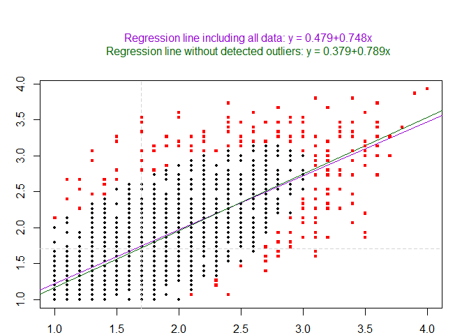

# Routliers

Routliers is designed to help researchers to detect univariate and
multivariate outliers, using robust methods: - The MAD method for
detecting univariate outliers (see Leys et al. 2013) - The MMCD method
for detecting multivariate outliers (see Leys et al. 2018) - The
Mahalanobis distance method for detecting multivariate outliers is also
available in order to facilite comparisons with the MMCD method.
However, this method is less robust than the MMCD method and should be
avoided.

Different functions are available in order to (a) detect univariate and
multivariate outliers (b) plot univariate and multivariate outliers.

## Installation

Currently, this package exists in a development version on GitHub. To
use the package, you need to install it directly from GitHub using the
`install_github` function from `devtools`.

You can use the following code to install the development version of
`Routliers`:

``` r
library(devtools)
install_github("mdelacre/Routliers")
```

As a note, one of the dependencies in `Routliers` (i.e. MASS) have its
own dependencies. You may be prompted to install additional packages to
be able to install `Routliers`.

## Examples of using the package

The `Routliers` package allows you to easily count, detect and plot
outliers using robust methods. The most important functions in the
package are `outliers_mad` and `outliers_mcd`, which allow to detect
univariate and multivariate outliers, respectively. By default, the MAD
function assume a normal distribution underlying the data and treat all
value more than 3 MAD around the median as outliers. Moreover, the MCD
function select by default h = n/2 observations on which the empirical
mean and empirical covariance matrix are calculated (see Leys et al.,
2018).

Here is an example of detecting extreme level of anxiety and depression
(based on the HSCL-25; Derogatis, Lipman, Rickels, Uhlenhuth & Covi,
1974) in a sample of 2077 participants after the Brussels attacks, using
the outliers\_mad function. The 10 first items of the HSCL-25 are
averaged in order to compute the level of anxiety and the 15 last items
of the HSCL-25 are averaged in order to compute the level of depression.
The MAD function is applied on the averaged scores.

``` r
data(Attacks)
anxiety <- rowMeans(Attacks[,c("hsc1","hsc2","hsc3","hsc4","hsc5","hsc6","hsc7","hsc8","hsc9","hsc10")])
outliers_mad(anxiety)
#> Results:
#> Median: 1.700
#> MAD: 0.593
#> 
#> Acceptable range of values:
#> lower MAD limit: -0.0791 
#> upper MAD limit: 3.4791
#> 
#> Outliers:
#> 
#> extremely small values: 
#> positions:  
#> values: 
#> 
#> extremely high values: 
#> positions: 96 120 194 821 852 934 1255 1337 1340 1345 1353 1482 1516 1603 1616 1623 1661 1772 1816 1922 1930 1931 1955 2016 2061 
#> values: 3.7 3.6 3.7 3.6 3.5 3.5 3.5 4 3.6 3.6 3.9 3.6 3.5 3.5 3.5 3.5 3.7 3.6 3.8 3.6 3.7 3.7 3.5 3.5 3.5
```

``` r
depression <- rowMeans(Attacks[,c("hsc11","hsc12","hsc13","hsc14","hsc15","hsc16","hsc17","hsc18","hsc19","hsc20","hsc21","hsc22","hsc23","hsc24","hsc25")])
outliers_mad(depression)
#> Results:
#> Median: 1.733
#> MAD: 0.593
#> 
#> Acceptable range of values:
#> lower MAD limit: -0.0458 
#> upper MAD limit: 3.5125
#> 
#> Outliers:
#> 
#> extremely small values: 
#> positions:  
#> values: 
#> 
#> extremely high values: 
#> positions: 234 990 1006 1164 1272 1337 1353 1355 1357 1441 1447 1507 1513 1772 1794 1955 2039 
#> values: 3.5333 3.5333 3.5333 3.8 3.6667 3.9333 3.8667 3.8 3.6 3.5333 3.6 3.6667 3.7333 3.7333 3.5333 3.6 3.6667
```

Here is an example of detecting extremely surprising combination of
scores of anxiety and depression, using the outliers\_mcd function.

``` r
outliers_mcd(data.frame(anxiety,depression))
#> Method: Minimum Covariance Determinant estimator
#> 
#> Results:
#> Max distance: 9.210
#> Number of outliers: 214
#> Outliers positions: 1 7 17 21 34 52 96 99 120 133 148 152 171 194 196 216 228 234 248 260 263 266 307 338 363 391 407 439 441 452 462 465 472 475 476 492 512 516 517 518 531 552 562 577 582 601 614 629 643 644 650 653 669 699 713 722 728 732 749 753 759 794 808 810 821 827 842 852 857 859 871 884 934 935 960 961 962 990 1001 1002 1006 1029 1033 1038 1040 1062 1068 1072 1081 1082 1100 1132 1136 1152 1164 1171 1172 1211 1219 1229 1236 1247 1255 1261 1272 1282 1296 1307 1311 1312 1328 1329 1337 1340 1345 1353 1355 1357 1361 1365 1366 1390 1412 1419 1422 1425 1426 1436 1441 1445 1447 1460 1470 1479 1481 1482 1507 1512 1513 1516 1518 1530 1541 1576 1586 1588 1594 1600 1603 1612 1614 1616 1619 1621 1623 1630 1640 1647 1649 1658 1661 1671 1675 1681 1682 1683 1719 1725 1739 1751 1761 1767 1771 1772 1791 1794 1809 1816 1823 1843 1848 1861 1873 1879 1882 1892 1903 1922 1930 1931 1944 1945 1951 1952 1955 1965 1969 1973 1976 1992 1995 1996 1997 2000 2011 2016 2039 2045 2047 2053 2056 2057 2061 2075
```

It is also possible to plot the outliers, using plot\_outliers\_mad and
plot\_outliers\_mcd functions:

``` r
plot_outliers_mad(depression)
```


the plot function for the mcd method is very useful as it allows to
compare the regression line with and without outliers (showing if there
is a strong impact of outliers on the regression line):

``` r
plot_outliers_mcd(data.frame(anxiety,depression))
```


